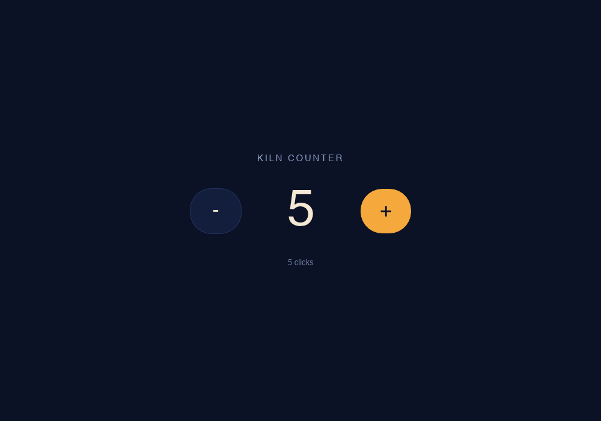
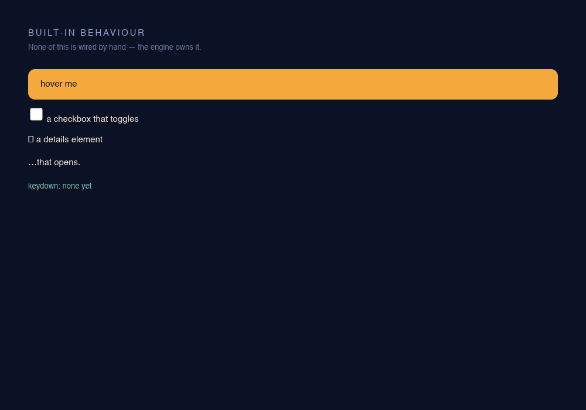
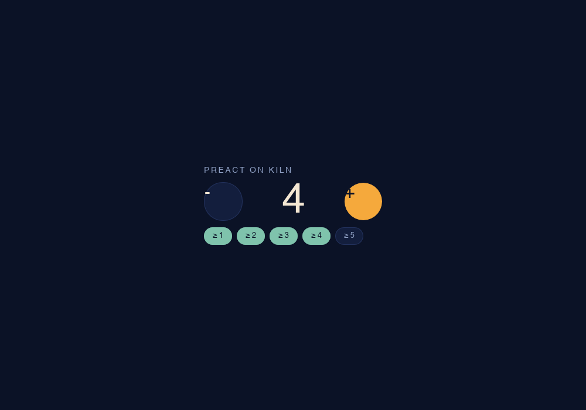
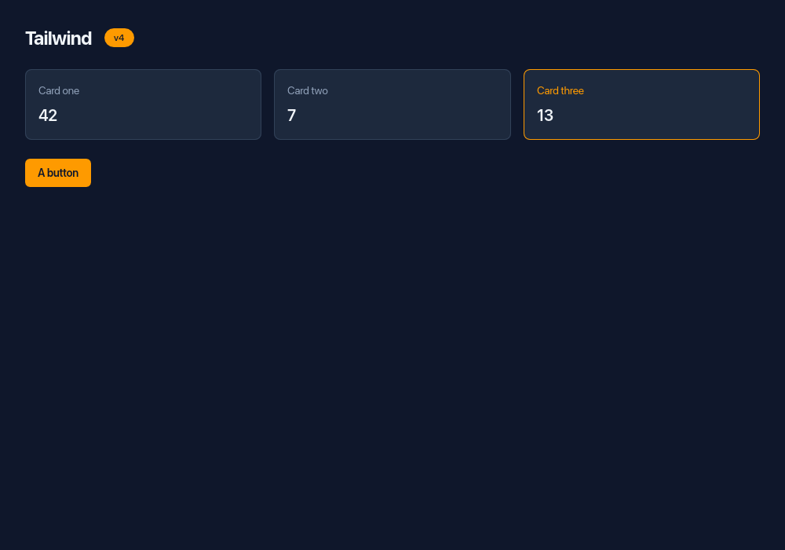
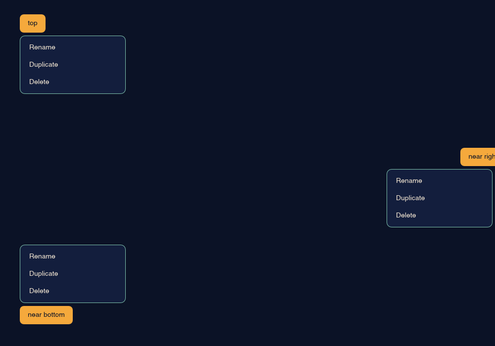
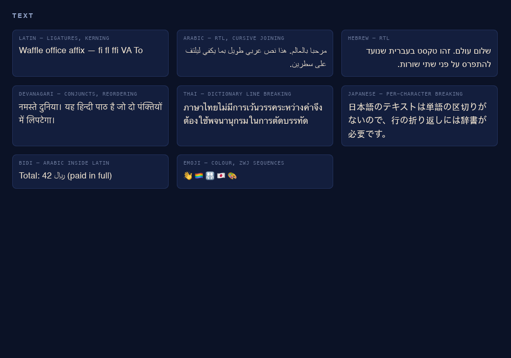
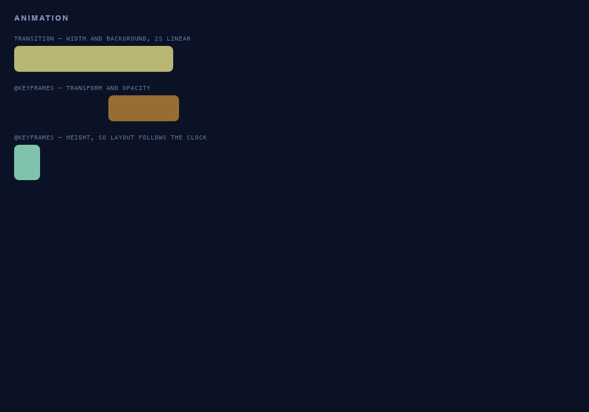
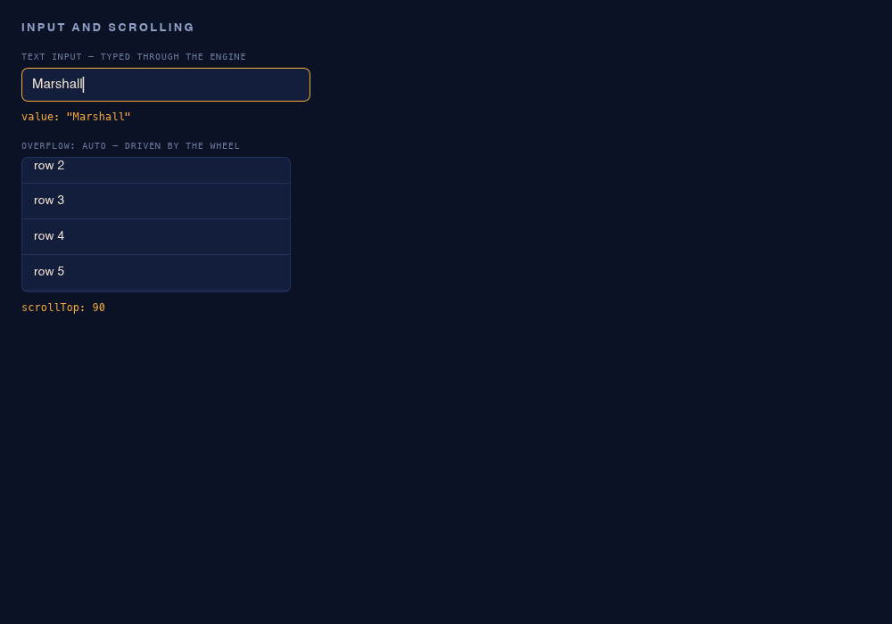

<p align="center">
  
</p>

<h1 align="center">Kiln</h1>

<p align="center">
  <em>Your HTML. Your CSS. No browser.</em>
</p>

<p align="center">
  
  
  
  
  
</p>

<p align="center">
  <strong>An early engine for native desktop apps, built from real HTML, CSS and TypeScript &middot; no Chromium, no WebView</strong><br>
  <sub>An unmodified Vite React build runs today, and <a href="#status">the gaps are listed</a> rather than glossed.</sub>
</p>

---

Electron ships an entire browser so you can render a settings page. Tauri borrows the OS WebView, so your app looks different on every machine and you don't control the engine. Both are reasonable trades.

Kiln makes a different one: we render it ourselves.

Your HTML gets parsed by a real HTML parser. Your CSS is resolved by Firefox's cascade engine. Your text is shaped by the same stack Firefox shapes text with. Then it's drawn on the GPU into a real OS window — with real menus, a real tray, and real accessibility — and none of it needs a browser to be there.

<p align="center">
  
</p>

## Status

Honesty is the product, so here is the unflattering version.

**What works.** An unmodified Vite React build renders and responds to clicks. Preact and Tailwind run as shipped. Text covers Arabic and Hebrew RTL, Devanagari conjuncts, Thai line breaking, CJK and colour emoji. Scrolling, typing, focus, CSS animation, native menus and a real accessibility tree all work. `kiln dev` hot-swaps CSS without losing app state, DevTools attaches over CDP, and `kiln package` builds an installer on macOS, Linux and Windows.

**What doesn't, and what it costs you:**

| | |
|---|---|
| CSS coverage | partial — `float`, tables, `position: sticky`, `:has()`, `@container` and subgrid are out. [`kiln check`](#the-subset) names every gap rather than failing silently |
| `position: fixed`, nested `position: absolute` | resolve against the wrong box. Both are upstream bugs, both are [reported by `kiln check`](#position-fixed-is-honest-about-being-wrong) |
| `text-overflow: ellipsis` | clips without drawing the ellipsis — needs truncation support in Parley first |
| Symbol glyphs | font fallback misses parts of the symbol ranges — `▸ ▾ ✓ ⇒` come out as missing-glyph boxes while `▶ ▼ ★ → •` are fine. Naming a font that has them works; the fallback chain just doesn't reach it |
| Code signing | `--sign` and `--notarize` are written but **have never been run with a real certificate**. If you sign a macOS build, you are the first |
| IME | wired, never tested against a real input method |
| Runtime self-update | out of scope — an app replaces its own assets, not its binary |
| Memory and cold start | 117 MB idle, 175 ms to first paint. Both are well over target, and the numbers are below |

### The numbers

Measured rather than estimated, with [`bench/run.sh`](bench/run.sh) in this repo. Apple M3 Pro, macOS, release build.

```
  binary, as built                   32.9 MB
  binary, stripped                   26.9 MB
  peak RSS, check (no GPU)           26.6 MB
  peak RSS, headless render          56.0 MB
  headless render, best of 5          114 ms
  window, first paint (warm)        175.1 ms
  window, idle RSS                  117.2 MB
```

**Two of the three targets are missed, and by a lot.** The premise of not shipping a browser was a binary of 20 MB rather than 200, a boot of 15 ms rather than 900, and 30 MB of resident memory rather than 400.

| | target | actual | |
|---|---|---|---|
| binary | 20 MB | 26.9 MB stripped | close |
| first paint | 15 ms | 175 ms | **12× over** |
| idle RSS | 30 MB | 117 MB | **4× over** |

The size target is roughly met, and the trajectory is documented: 25.1 MB before Thai line breaking, 28.8 MB after, 30.0 MB after the native surfaces, 32.9 MB now. Every increase was a named feature.

The other two are the GPU stack, and the split says so. `kiln check` parses, cascades and lays out with no renderer at all: **26.6 MB**. Adding wgpu and Vello for a headless render takes it to **56.0 MB**. A real window with a swapchain reaches **117 MB**. So roughly a quarter of resident memory is the engine this project actually writes, and the rest is the renderer it assembles.

**The first launch is far worse than the steady state, and the cause is now known.** It is Vello's shaders being compiled for the GPU and cached by the OS. Move macOS's Metal shader cache aside and the next launch takes **1949 ms**; the one straight after it, with the cache repopulated, takes **233 ms**. That is the whole gap.

It also explains the odd part: a freshly *copied* binary was slow once and then fast, because the cache is system-wide rather than per-binary. A rebuild does not reproduce it either. So the cost is paid once per machine, by whichever Vello application runs first — not once per install of your app.

Nothing in `src/` can fix that, but the shape of a fix is narrower than it first looked. Vello already accepts a `pipeline_cache`; `anyrender_vello` hardcodes it to `None` and offers no way to set one, so no consumer can opt in — filed as [anyrender#72](https://github.com/DioxusLabs/anyrender/issues/72).

That would not help here, though. `wgpu-hal`'s Metal `create_pipeline_cache` is a unit-struct stub, as are DX12 and GLES; only Vulkan builds a real one. macOS gets its speedup from the OS cache instead, which is exactly why the second launch is already fast. So the win is Linux, and on macOS the 1.9 seconds is a cost paid once per machine by whichever Vello app runs first.

None of this is compared against Electron or Tauri, because nothing here runs them. Treat it as a floor to improve on and a regression check, not as a competitive claim.

## Getting started

There is no published crate yet, so install from the repository:

```console
$ cargo install --git https://github.com/marshallshelly/kiln
```

Or build it locally, which is what you want if you plan to change anything:

```console
$ git clone https://github.com/marshallshelly/kiln
$ cd kiln
$ cargo build --release        # target/release/kiln
```

On Linux you also need GTK, `libxdo` and appindicator for the native menu, tray
and dialog surfaces, plus X11 and Wayland headers for the window. macOS and
Windows need nothing beyond a recent Rust toolchain.

Then scaffold something and open it:

```console
$ kiln init my-app
$ kiln dev  my-app/index.html
```

`kiln init` writes a working counter that is already inside the CSS subset, and
`kiln dev` opens it in a real window and watches it — a CSS edit swaps the
stylesheet without losing state, and a JS edit reloads.

**Bringing an existing app.** If it builds to static HTML, CSS and JavaScript,
point Kiln at the output. For a Vite project that means one flag:

```console
$ vite build --base ./          # relative asset paths, not /assets/…
$ kiln check dist/index.html    # what CSS Kiln cannot honour, before you debug it
$ kiln dev   dist/index.html
```

Run `kiln check` first. It is faster than discovering the gaps by looking at
wrong pixels, and it is the difference between an incomplete engine and an
illegible one.

## Why not just use a WebView

|  | Electron | Tauri | Kiln |
|---|---|---|---|
| Author in HTML/CSS/TS | yes | yes | yes |
| Ships a browser | Chromium | borrows the OS WebView | **no** |
| Identical rendering on every OS | yes | **no** | yes — [layout and text metrics asserted on all three platforms](#building) |
| You control the engine | no | no | **yes** |
| Full CSS support | yes | yes | **no — see [The subset](#the-subset)** |
| Production ready | yes | yes | **no — see [Status](#status)** |

<p align="center">
  
</p>

The last two rows are on purpose. Tauri is the right answer whenever the host WebView is acceptable to you; the overlap is real and worth saying out loud. Kiln is for when it isn't — when rendering has to be identical everywhere, when you need the engine to be something you can reason about, or when 40 MB of resident memory before the first paint is too much.

## Assemble, don't build

The load-bearing decision in this project is what it *doesn't* write.

<p align="center">
  
</p>

| Layer | Crate | Why |
|---|---|---|
| CSS | [Stylo](https://github.com/servo/stylo) | Firefox's actual cascade engine. Real selector matching, real invalidation, real custom properties. |
| Layout | [Taffy](https://github.com/DioxusLabs/taffy) | Flexbox, CSS Grid, block, absolute. |
| Text | [Parley](https://github.com/linebender/parley) | Shaping, bidi, line breaking, font fallback. The subsystem that kills projects like this one. |
| Paint | [Vello](https://github.com/linebender/vello) + [wgpu](https://github.com/gfx-rs/wgpu) | GPU compute rasterizer. Metal, D3D12, Vulkan from one backend. |
| Window | [winit](https://github.com/rust-windowing/winit) | Events, IME, HiDPI, multi-monitor. |
| Accessibility | [AccessKit](https://github.com/AccessKit/accesskit) | UIAutomation, AT-SPI, NSAccessibility. |
| HTML | [html5ever](https://github.com/servo/html5ever) | Servo's spec-compliant parser. |
| Script | [QuickJS-ng](https://github.com/quickjs-ng/quickjs) | ~620 KB, ES2023, bytecode precompilation. |

Most of the first seven are already assembled by [Blitz](https://github.com/DioxusLabs/blitz), which Kiln builds on. Blitz has no JavaScript. That is precisely and only the thing this project adds — the DOM bridge, the script runtime, the CLI, the tooling, and the packaging.

Writing a CSS engine or a text-shaping stack from scratch is the failure mode this repo exists to avoid.

<p align="center">
  
</p>

## The subset

Kiln is not a browser and will never render arbitrary websites. HTML and CSS are the *authoring* language, not a compatibility promise.

Some of CSS is therefore out of scope for v1 — `float`, table layout, `position: sticky`, `:has()`, `@container`, `backdrop-filter`, 3D transforms, subgrid.

The important part is not the list, it's the mechanic: **a property Kiln can't honor will never be a silent no-op.** `kiln check` reports every unsupported declaration with a code, a `file:line:column`, and a rewrite hint:

```console
$ kiln check examples/unsupported.css

  examples/unsupported.css
    declarations         16
    supported             5  (31%)

    ×1   .card:has(> .selected)             KC1002  not supported — restructure or use a class
         examples/unsupported.css:35:1
    ×1   sidebar                            KC1101  use flexbox or grid
         float: left
         examples/unsupported.css:5:3
    ×1   legacy                             KC1102  use flexbox or grid
         display: table-cell
         examples/unsupported.css:31:3
    ×1   legacy                             KC1150  not supported
         writing-mode: vertical-rl
         examples/unsupported.css:32:3
    ×1   toolbar                            KC1201  use a fixed header plus scroll padding
         position: sticky
         examples/unsupported.css:10:3
```

It runs over `.css` files and the `<style>` blocks inside `.html`, and it is tested in both directions: [`tests/golden/check.txt`](tests/golden/check.txt) pins that report, and another test asserts every committed example stays inside the subset.

A silently ignored property is the fastest way to destroy trust in an engine like this: you write correct CSS, see wrong pixels, and blame yourself. Making the gap explicit and teachable turns an incomplete engine into a legible one.

## What runs today

HTML and CSS render, and JavaScript can drive the DOM.

```console
$ kiln init   my-app                 # scaffold a working counter
$ kiln dev    my-app/index.html      # native window, reloads on save
$ kiln check  my-app/index.html      # report unsupported CSS
$ kiln build  my-app/index.html dist # bundle the app and its scripts
$ kiln render my-app/index.html out.png --click "#inc"   # headless
```

`kiln dev` watches the entry, every script it references, every module those import, and every linked stylesheet.

**A CSS edit swaps the stylesheet under the running app.** Nothing is torn down, so every scrap of application state survives by construction rather than by being saved and restored.

A JS edit rebuilds the runtime, and that is a limit rather than a choice: QuickJS caches modules and rquickjs exposes no way to evict one, so a module cannot be replaced in a live context. State crosses that gap only if the page writes it down:

```js
let count = kiln.hot.data.count ?? 0;
kiln.hot.dispose((data) => { data.count = count; });
```

`dispose` runs while the old runtime is still alive; `data` is what the next one receives. A page that never calls `dispose` pays nothing and behaves exactly as it did before the API existed.

### DevTools attaches over CDP

```console
$ kiln dev examples/counter.html --inspect
devtools listening on 127.0.0.1:9223
```

`Runtime.evaluate`, `DOM.getDocument`, `DOM.getOuterHTML`, `DOM.getBoxModel`, `CSS.getComputedStyleForNode` and the discovery endpoints are served, so you can inspect a running Kiln app with the tool you already use.

The document is not `Send`, which shaped the design: `tungstenite` is blocking, so a connection is a thread, and those threads hand work to the event loop over a channel rather than touching the DOM. That also keeps the protocol layer a plain function over the document — which is how it gets tested without a socket.

<p align="center">
  
</p>

That is [`examples/counter.html`](examples/counter.html) after five clicks. The page holds an ordinary `<script>`:

```js
const display = document.querySelector("#count");
document.querySelector("#inc").addEventListener("click", () => {
  display.textContent = ++count;
});
```

`document` and `Element` are a thin JavaScript shim over four native calls. **Nodes live in Rust; JavaScript only ever holds an opaque id.** Setting `textContent` mutates the real document, which marks it dirty, which re-runs style and layout on the next frame — the same path a resize takes.

Input goes through Blitz's `EventDriver`, so the engine's built-in behaviour comes with it — `:hover`, checkbox and radio toggling, `<details>` disclosure, focus, and form submission all work without a line of application code:

<p align="center">
  
</p>

JavaScript gets real event objects — `type`, `key`, `target`, `currentTarget`, `clientX/Y`, `preventDefault()`, `stopPropagation()` — and clicks bubble through ancestors, so a listener on a `<button>` fires when the hit lands on the text inside it.

[`examples/hello.html`](examples/hello.html) exercises the CSS side — custom properties, descendant selectors, flexbox with `gap` and `flex: 1`, `border-radius`, `linear-gradient`, inline styles, `letter-spacing`, monospace fallback. None of it is special-cased in Kiln; Stylo resolves the cascade and Taffy does layout.

Events can be driven without a mouse, which is how the counter above was verified:

```console
$ kiln render examples/counter.html out.png --click "#inc" --click "#dec"
$ kiln render examples/counter.html out.png --click-at 642,351
$ kiln render examples/controls.html out.png --click "summary" --hover ".box"
```

All of them synthesize real pointer events and run the same `EventDriver` path the window uses — `--click` just resolves a selector to its centre point first. Flags apply **in the order you write them**, so the last line above opens the disclosure and *then* moves the pointer onto the box.

## Preact runs

An unmodified Preact build renders and updates against Kiln's DOM, hooks and all:

<p align="center">
  
</p>

```console
$ cargo run -- render examples/preact.html out.png --click "#inc" --click "#inc"
```

[`examples/preact.html`](examples/preact.html) loads `preact.umd.js` and `hooks.umd.js` with `<script src>` — no build step, no shim, no patched fork. `useState` triggers a re-render, Preact diffs, and the DOM mutations flow through style, layout and paint.

Getting there needed three specific things, each worth knowing if you're porting another framework:

- **Stable node identity.** Preact compares DOM nodes with `===`, so JavaScript wrappers are cached per node id rather than created per call.
- **`onclick` must exist as a property.** Preact lowercases an event name only if `"onclick" in element`; otherwise it registers the type as `"Click"` and nothing ever matches. Handlers are also called with `this` bound to the node, which its event proxy relies on.
- **The microtask queue has to be drained.** Preact schedules re-renders on a promise. Without draining QuickJS's job queue after every script evaluation and event dispatch, state updates run and the screen never changes.

## A real Vite build runs

`pnpm create vite --template react-ts`, `vite build --base ./`, and Kiln renders the output — React mounts, assets load, and clicking the counter updates it. No shims, no IIFE bundling, no patched fork.

```console
$ kiln render dist/index.html out.png --click "button.counter"
```

`<script type="module">` runs inline or from `src`, `import "./thing.js"` resolves off disk, and a resolved path must still sit inside the app directory — so `import "../../../etc/passwd"` fails to resolve rather than reading the file.

Two things bundler output depends on are in the prelude: `import.meta.url`, which is how bundlers address their assets, and `URL`/`URLSearchParams`, which QuickJS does not ship. The URL implementation covers enough of RFC 3986 for real bundles and is deliberately not WHATWG — no IDNA, no percent-encoding normalisation. Every case in [`examples/url.html`](examples/url.html) is diffed against Chrome.

`--base ./` matters: Vite defaults to `/assets/…`, and a root-absolute path under `file:` resolves against the filesystem root.

Script ordering follows the spec too — classic scripts run where the parser meets them, modules and `<script defer src>` run after parsing, and `defer` on an *inline* script is correctly ignored.

## Tailwind works

Tailwind v4 renders as written — `oklch()` colours, `@layer` cascade layers, grid, and Preflight's reset:

<p align="center">
  
</p>

```console
$ kiln render examples/tailwind.html out.png
$ kiln check  examples/tailwind.html
    declarations        333
    supported           333  (100%)
```

That is real generated CSS, vendored in [`examples/vendor/`](examples/vendor/) so the claim can be rebuilt.

`<link rel="stylesheet">` and other local sub-resources resolve against a `file:` base URL. Nothing is fetched over the network, and an attempt to reach it fails out loud rather than quietly.

### check speaks in utilities

`display: flex` is not what you edit — `flex` is. So findings from generated CSS report the utility, with the declaration underneath:

```console
    ×1   sticky                             KC1201  use a fixed header plus scroll padding
         position: sticky
         examples/vendor/tailwind.css:213:5
```

Only utilities the markup actually uses are reported. Tailwind ships more CSS than any page references, and telling you about `truncate` when you never wrote it is noise, not honesty.

## Base UI runs

Unstyled component primitives work too. [Base UI](https://base-ui.com) `1.0.0-rc.0`'s `Menu` — trigger, portal, positioner, popup — renders and opens, on `preact/compat` rather than react-dom. The bundle is vendored in [`examples/vendor/`](examples/vendor/), so this is reproducible with no install step:

```bash
cargo run -- render examples/baseui.html out.png
```

That needs real layout geometry rather than stubs, which is what a component library will exercise first:

- **`getBoundingClientRect`, `offset*`, `client*`, `scroll*`** report actual values from the layout tree — border box, padding box, content size and scroll offset kept distinct rather than collapsed into one number.
- **Reading geometry forces a synchronous layout flush**, because floating-element libraries measure inside a timer, before the next frame.
- **`ResizeObserver`, `IntersectionObserver` and `MutationObserver` are real.** The first two run off the layout pass; layout re-runs until observers stop firing, bounded at four passes like a browser's resize-loop guard.
- **`getComputedStyle` returns resolved values** — lengths from the layout tree, keywords from the cascade. Floating-ui reads it nine times in a bundled Base UI build.

### Collision detection and edge flipping work

Three menus, all opened against a viewport edge, in one headless render of [`examples/baseui.html`](examples/baseui.html):

<p align="center">
  
</p>

Nothing in the page says where these should go. Floating-ui measures the trigger, compares it against the viewport, and writes a transform:

| Trigger | Computed transform | Behaviour |
| --- | --- | --- |
| `top` at y=29 | `translate(40px, 72px)` | opens downward, 6px below the trigger |
| `near bottom` at y=619 | `translate(40px, 495px)` | **flipped** — 619 − 118 − 6, above the trigger |
| `near right` at x=930 | `translate(781px, 342px)` | **shifted left** to keep 214px on screen |

Those three transforms are pinned by [`tests/golden/baseui.txt`](tests/golden/baseui.txt), so a regression in positioning fails `cargo test` rather than quietly changing a screenshot.

Still missing: `getBoundingClientRect` ignores transforms, so a positioned popup reports its untransformed box.

### `position: fixed` is honest about being wrong

Taffy has no `fixed`, so `stylo_taffy` maps it to `absolute`. The cascade still reports `fixed` — `getComputedStyle` says so, and so does the snapshot — but layout resolves the element against its nearest positioned ancestor rather than the viewport. [`examples/fixed.html`](examples/fixed.html) pins every case:

| Case | Result |
| --- | --- |
| no positioned ancestor | **correct** — `absolute` and `fixed` share the initial containing block |
| inside `position: relative` | wrong offset, the ancestor's origin is added |
| `inset: 0` inside one | wrong offset *and* wrong size — stretches to the ancestor, not the viewport |

**`position: absolute` has the same bug** whenever the element is not a direct child of its positioned ancestor. [`examples/absolute.html`](examples/absolute.html) puts both cases side by side: a mark that is a direct child lands at `12,12`, matching Chrome; the same mark one unpositioned `<div>` deeper lands at `72,77`. The cause is in Taffy, which lays absolute children out against their *direct parent* and never walks up.

Both are filed upstream — [blitz#549](https://github.com/DioxusLabs/blitz/pull/549) and [taffy#1008](https://github.com/DioxusLabs/taffy/issues/1008) — and until they land `kiln check` reports them (KC1202, KC1203) rather than letting them be silent. KC1203 reads the *document* rather than the stylesheet, because whether an element is affected is a fact about the tree: a blanket warning on `position: absolute` would be wrong more often than right.

This is the class of bug most likely to bite you, and it is worth knowing why it usually doesn't: Base UI and shadcn position with `transform` rather than `top`/`left`, which sidesteps the containing block entirely.

## Non-Latin text

The subsystem that kills projects like this one. Vercel's Native SDK is honest about its own: *"no hinting, no kerning, no shaping, no CFF"* — which means no Arabic, no Devanagari, no ligatures.

Kiln doesn't have that problem, because Kiln didn't write a text stack. Parley does the shaping, bidi, line breaking and font fallback:

<p align="center">
  
</p>

```bash
cargo run -- render examples/text.html out.png
```

Arabic and Hebrew lay out right-to-left with correct cursive joining. Devanagari forms conjuncts and reorders matras. A bidi run embeds Arabic inside an English sentence at the right position. Emoji render in colour, including ZWJ sequences like 👨‍👩‍👧‍👦 that are four codepoints joined into one glyph.

Thai, Lao, Khmer and Burmese have no spaces between words, so they need dictionary segmentation to know where a line may break. Those dictionaries are compiled in, which costs 3.7 MB of the binary — worth stating, since it is a fifth of the download and the alternative is Thai text running out of its container.

Still missing: **`text-overflow: ellipsis` clips without drawing the ellipsis.** It isn't implemented in Parley, so it needs truncation support upstream first.

**Font fallback also has a hole in the symbol ranges.** `▸ ▾ ✓ ⇒` render as missing-glyph boxes where `▶ ▼ ★ → •` are fine — and the fonts that have them are installed, since naming Menlo or STIXGeneral explicitly renders all three. That is what puts the box on the `<details>` marker in the screenshot above: Blitz picks `▸` for `disclosure-closed` and the inside-marker path never asks for the bullet font it bundles for exactly this. Fixed upstream in [blitz#600](https://github.com/DioxusLabs/blitz/pull/600); the wider fallback gap is Parley's and is not filed yet.

## Animation

CSS transitions and `@keyframes` run off a real clock. In a window it advances from an `Instant` and re-requests a frame while anything is animating, so animation drives redraws rather than input.

Headless, the clock is a flag — which is what makes animation testable at all:

```bash
cargo run -- render examples/animation.html out.png --at 1.0
```

<p align="center">
  
</p>

That is a single deterministic frame one second into a two-second timeline. The bar is 270px through a 120→420 transition with its background interpolated between amber and mint; the second box has translated 160 of 320px and faded to 0.6 opacity; the third is at its `@keyframes` height peak. A golden is blessed at exactly that instant, so a stalled clock fails the build rather than quietly rendering the first frame forever.

## Scrolling, focus and typing

An app has to accept a keystroke and scroll a list. Both now work, and both are driven headlessly so they are testable:

```bash
cargo run -- render examples/input.html out.png --type "Marshall" --scroll "#list,0,90"
```

<p align="center">
  
</p>

Nothing in that page polls. The input's `input` listener wrote the echo line, the list's `scroll` listener wrote `scrollTop: 90`, and the `:focus` border came from the cascade.

Scrolling works from script as well as from the wheel: `scrollTop` and `scrollLeft` are writable, and `scrollTo`, `scrollBy` and `scrollIntoView` all take either positional arguments or an options object. A scripted scroll fires one coalesced `scroll` event, the way a browser does rather than one per call. Every case was diffed against Chrome and matches, apart from scrollbar reservation — Chrome reserves width in `clientHeight` where Kiln does not.

## Native where it should be native

Menus, the tray, the clipboard, file dialogs and notifications are real OS objects, not drawn by Kiln. JavaScript sees one `kiln.*` global:

```js
kiln.menu.set([
  { label: "File", items: [
      { id: "new", label: "New Window", accelerator: "CmdOrCtrl+N",
        click: (id) => console.log(id) },
      "-",
      { id: "close", label: "Close", enabled: false },
  ]},
]);

kiln.clipboard.writeText("written by kiln");
kiln.notify("Done", "Export finished");
```

A native menu bar cannot be checked by a screenshot, so the menu is kept as a **model** and the OS binding is a thin adapter over it. The model serialises, which makes the structure a golden like everything else:

```console
$ kiln render examples/native.html out.png --menu out.txt

"File"
  "New Window" #new [CmdOrCtrl+N]
  ---
  "Close" #close [CmdOrCtrl+W] disabled
```

Being explicit about what that does and doesn't prove: the menu and tray structure are pinned by a golden, and the clipboard round-trips in a real test that skips when the machine has no clipboard. Dialogs and notifications are fire-and-forget and are **not** verified — they block on the OS, and no golden covers them.

## The accessibility tree is testable

Semantic HTML maps to a real accessibility tree, and because it is text it can be a golden like everything else:

```bash
cargo run -- render examples/semantics.html out.png --a11y out.txt
```

```
window
  header
    heading
      text-run value="Semantics"
  button
    text-run value="Save"
  check-box
  text-run value="Subscribe"
```

**One gap to know about if you need this today.** Roles are currently thin: 21 nodes in that example come back `unknown`, including `<a>`, `<nav>`, `<main>`, `<ul>`, `<li>`, `<table>` and `<label>`, so a screen reader gets little useful for navigation or lists. The HTML-AAM mappings are merged upstream in [blitz#550](https://github.com/DioxusLabs/blitz/pull/550) and arrive on the next Blitz release; the golden still records the `unknown` roles until then, which is how you will see it flip.

Accessibility being a golden rather than a promise is the point. It is usually an afterthought in a project like this, which is exactly why it is asserted here.

## Record and replay

An interaction can be recorded and replayed, and the replay fails if anything about the run changed:

```console
$ kiln record examples/counter.html --out t.kiln --click "#inc" --click "#inc" --click "#dec"
recorded 3 steps, 6 mutations -> t.kiln

$ kiln replay examples/counter.html t.kiln
replayed 3 steps, 6 mutations — identical to the recording
```

The trace holds the interaction and a fingerprint of what the document did — every DOM mutation in order, plus a digest of the settled tree. Both halves earn their place: the mutation sequence catches a different *route*, and the digest catches a different *destination*. Clicking increment three times touches the same nodes in the same order as two increments and a decrement, so without the digest the oracle would call them identical.

Automation runs over the same CDP server DevTools uses, rather than a second protocol:

```js
await send("DOM.querySelector", { selector: "#inc" });
await send("Input.dispatchMouseEvent", { type: "mousePressed", x, y });
```

Dispatched input goes through the same `EventDriver` path a real mouse takes, so anything an automation client can do, a user could have done.

## Tests read text, not pixels

A PNG is a poor oracle for a DOM bug: it shows the final state, hides the sequence, cannot say *why* a box landed where it did, and churns on font and antialiasing drift. So the primary artifact is a serialisation of the settled tree — every element's path, box, resolved `display` and `position` — driven through the same click path the CLI uses, so interaction state is part of the diff.

```bash
cargo test
```

The headless renderer is what makes that possible, and it is not a debugging convenience: it shares one document and one paint call with the windowed path, so the two cannot drift.

## Shipping an app

```console
$ kiln package app/index.html --name "My App" --dmg
  declarations         26
  supported            26  (100%)
  dist/My App.dmg
  dist/My App.app
```

The bundle carries the Kiln runtime, your page renamed to `index.html`, and every local file it references with paths intact — so a `<link>` that worked in development still resolves inside the bundle. Double-clicking it opens your app; the runtime locates its own page relative to the executable.

`--dmg`, `--deb` and `--msi` opt into an installer for the platform you're on. Each is a known directory layout plus one system tool, so there's no bundler dependency. CI builds all three on their own platforms and **installs the `.deb` with `dpkg -i`** before running the installed binary, because listing an archive's contents would not catch a broken symlink.

`--sign` and `--notarize` shell out to Apple's own `codesign` and `notarytool`. Both are written and **neither has ever been run end to end**, because that needs a Developer ID certificate. Treat them as untested code paths: if you sign a build and something is wrong with the flags or the ordering, you will be the one to find it. An issue with the output of `codesign --verify --deep --strict` would be a genuinely useful contribution.

### Updating a shipped app

```console
$ kiln package app/index.html --update-url https://example.com/feed.json \
                              --update-key RWQf6LRC…
```

An app can replace **its own `app/` directory** — not the runtime binary. That split is what makes it cheap: no binary to overwrite, no re-signing, no notarization to invalidate, and none of the platform grief of replacing a running executable. Runtime self-update is deliberately out of scope.

```js
const version = kiln.update.check();      // null when nothing is newer
if (version && confirm(`Install ${version}?`)) kiln.update.apply();
```

Kiln draws no update UI; the app decides. Bundles are signed with [minisign](https://jedisct1.github.io/minisign/) and verified before anything is written — TLS says which host answered, not whose bytes arrived. The public key lives *beside* `app/` rather than inside it, because a key in the replaceable tree would let one compromised release authorise every release after it. Downgrades are refused, and the install is two renames so a crash leaves one whole tree or the other.

**This is the only place Kiln touches the network**, and only when an app was packaged with an update URL.

## Building

Requires a recent Rust toolchain. On Linux you also need GTK, `libxdo` and
appindicator for the native menu, tray and dialog surfaces, plus X11 and
Wayland headers for the window.

```console
$ cargo build
$ cargo test
$ cargo clippy --all-targets --all-features --locked -- -D warnings
```

CI builds and tests on macOS, Linux and Windows, and builds an installer on
each.

Two goldens hold the "identical rendering" claim rather than letting it sit as
an assertion, and both are compared byte-for-byte on **all three platforms**.
[`examples/geometry.html`](examples/geometry.html) has no laid-out text and no
font-relative units, so nothing is left to vary: flex grow and basis, wrapping,
grid with `fr` and spans, absolute insets, `aspect-ratio`, min/max clamping and
a scroll container. [`examples/text-metrics.html`](examples/text-metrics.html)
uses a single vendored face with **no fallback anywhere**, so the same file
feeds the same shaper everywhere — the case that matters, since a shipped app
vendors its fonts rather than hoping the host has them.

**What that does and does not prove.** Layout and text metrics are identical to
the quarter-pixel across the three platforms, along with the CSS report, the
accessibility tree and the menu model. It compares boxes, not pixels:
paint-level identity — antialiasing, hinting, subpixel positioning — is still
unverified.

## Contributing

The project is early enough that the most useful contribution is argument. If you think the architecture is wrong, the subset is drawn in the wrong place, or a dependency is a mistake, open an issue and say so.

## License

[Apache-2.0](LICENSE).
